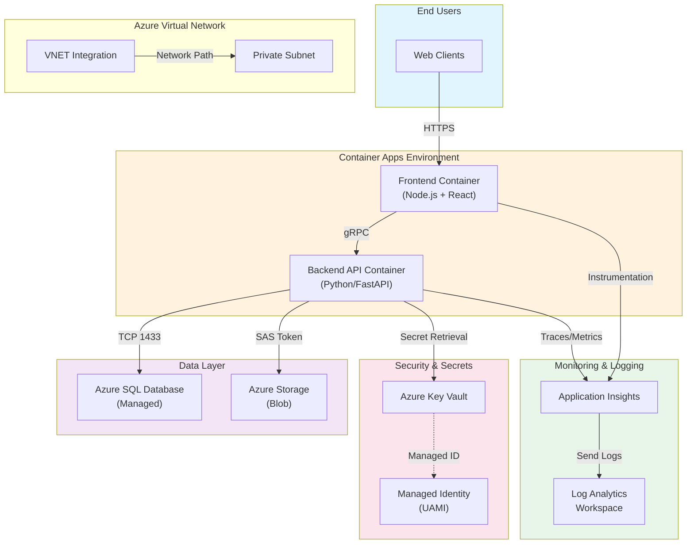

# Contoso Sample App — Reference Architecture

**Purpose:** This document describes the architecture of the `contoso-sample-app`, the shared workload used throughout the L300/400 workshop. Used as a knowledge source in **M4 (Skills Authoring)** and as context for all custom agents.

**Audience:** SRE operators, platform engineers, custom agent authors.

---

## 1. Architecture Overview

The `contoso-sample-app` is a three-tier web application deployed on Azure Container Apps with relational database persistence, integrated monitoring, and key management.

### System Diagram



### Technology Stack

| Layer | Component | Version | Purpose |
|-------|-----------|---------|---------|
| **Frontend** | Node.js | 20.x | Static + client-side routing |
| | React | 18.x | UI framework |
| **Backend** | Python | 3.12 | FastAPI REST API |
| | FastAPI | 0.104+ | Async web framework |
| **Database** | Azure SQL | Managed (Gen5) | Relational data; automated backups |
| **Storage** | Azure Blob | Hot tier | User uploads, logs archive |
| **Compute** | Container Apps | Flexible | Serverless container orchestration |
| **Networking** | Azure VNET | Custom | Private subnet for DB integration |
| **Secrets** | Azure Key Vault | Standard | Connection strings, API keys |
| **Identity** | Managed Identity (UAMI) | User-assigned | Passwordless auth to dependent services |
| **Observability** | Application Insights | Enterprise | APM, distributed tracing, live metrics |
| | Log Analytics | Standard | Long-term log retention, KQL queries |

---

## 2. Deployment Architecture

### Resource Group Layout

```
Resource Group: rg-sre-agent-workshop
├── Container Apps Environment
│   ├── frontend-app (revision: active-20250201-1)
│   └── backend-api (revision: active-20250201-1)
├── Azure SQL Server
│   └── contoso-db (elastic pool: ep-prod)
├── Azure Storage Account
│   └── Blob container: app-uploads
├── Key Vault
│   ├── sqlconnectionstring (secret)
│   ├── apikey (secret)
│   └── jwtkey (secret)
├── VNET + Subnets
│   ├── Subnet: data-subnet (CAE integration)
│   └── Subnet: compute-subnet
├── Application Insights
│   └── contoso-ai (frontend + backend instrumented)
└── Log Analytics Workspace
    └── contoso-law (30-day retention)
```

### Container Revisions & Rollout

- **Active revision:** Latest deployed code; 100% traffic.
- **Inactive revisions:** Previous versions; zero traffic; retained for 48h for quick rollback.
- **Auto-scaling:** Container Apps scales 0–10 replicas based on CPU (70%) and memory (80%).

---

## 3. Communication Flows

### A. Frontend → Backend (gRPC)

```
Client (browser)
  → HTTPS → Load Balancer
    → Frontend Container (Node.js)
      → gRPC TLS → Backend Container (Python/FastAPI)
        → Azure SQL (parameterized queries, connection pooling)
        → Application Insights (request telemetry)
```

**Key points:**
- Frontend uses Node.js HTTP server; routes to backend via authenticated gRPC.
- Backend uses SQLAlchemy ORM for database access; prepared statements prevent injection.
- Both containers emit traces (OpenTelemetry SDK) to Application Insights.

### B. Backend → Key Vault (Passwordless)

```
Backend Container (UAMI assigned)
  → [Managed Identity token endpoint]
    → Azure AD (issues bearer token)
      → Key Vault (validates token)
        ← Returns secret (connection string, API key)
```

**Credential flow:**
- Backend startup: request MSI token from `169.254.169.254` (Azure Instance Metadata Service).
- Token cached in process; renewed 5 min before expiry.
- Key Vault AAD policy: UAMI has `Get`, `List` permissions (no `Delete`).

### C. Backend → Application Insights (Direct Instrumentation)

```
Backend process
  ├── OpenTelemetry Exporter (SDK auto-instrumentation)
  ├── Emits span (request ID, service name, latency, result)
  └── → Application Insights Ingestion
    → Live Metrics Dashboard
    → Log Analytics Workspace (analytics store)
```

---

## 4. Data Flow & Consistency

### Request Path (Example: GET /api/users)

```
1. Client sends HTTPS GET /api/users to frontend
2. Frontend validates JWT (cached in-memory)
3. Frontend gRPC call → backend.getUserList(token, filters)
4. Backend:
   a. Validates JWT (checks issuer, expiration, scopes)
   b. Opens SQL connection (pool reuses existing TCP session)
   c. Executes parameterized query: SELECT * FROM Users WHERE active=1
   d. Deserializes rows into Python objects
   e. Serializes response to JSON
   f. Emits OpenTelemetry span to Application Insights
   g. Returns gRPC response (HTTP/2)
5. Frontend deserializes, renders React component
6. Browser renders HTML
```

### Database Consistency

- **Primary:** Azure SQL (write master).
- **Replication:** Geo-redundant backups (automatic daily snapshots).
- **Connection pooling:** Backend maintains 10–50 persistent connections (configurable).
- **Transaction isolation:** `READ COMMITTED` (default); app uses explicit transactions for multi-row updates.

---

## 5. Security Architecture

### Authentication & Authorization

| Layer | Mechanism | Token Lifetime | Validation |
|-------|-----------|-----------------|------------|
| **Browser → Frontend** | HTTPS + Session Cookie | 1 hour | Cryptographically signed; HttpOnly flag; SameSite=Strict |
| **Frontend → Backend** | JWT (Bearer token in Authorization header) | 15 min | Signature verified via public key; issuer/audience checked |
| **Backend → Key Vault** | Managed Identity (Azure AD bearer token) | 24 hours (auto-renewed) | Azure AD OAuth2; MSI endpoint validates tenant ID |
| **Backend → Database** | Connection string (in Key Vault) | Per-request | Parameterized query; username/password not in code |

### Network Isolation

- **VNET integration:** Container Apps environment resides in dedicated private subnet.
- **NSG rules:** Inbound HTTPS only (port 443); outbound restricted to Key Vault, SQL, Application Insights (DNS + HTTPS).
- **Firewall:** Azure SQL firewall allows inbound traffic only from Container Apps subnet (IP range hardcoded).

### Secret Rotation

- **Frequency:** Every 90 days (automated via Azure Policy).
- **Process:** Key Vault secret updates; backend polls metadata service for new token on next request.
- **No restart required:** Middleware detects stale token; fetches new one transparently.

---

## 6. Observability & Diagnostics

### Application Insights Instrumentation

#### Frontend Instrumentation

```javascript
// src/index.js
const appInsights = new ApplicationInsights({
  config: {
    instrumentationKey: process.env.APPINSIGHTS_KEY,
    endpointUrl: "https://eastus-3.in.applicationinsights.azure.com/",
    namePrefix: "contoso-frontend",
    samplingPercentage: 100,  // 100% for workshop
    disableAjaxTracking: false,
    enableDebug: false
  }
});
appInsights.loadAppInsights();
```

**Auto-collected:**
- Page views + load time
- Dependency calls (gRPC → backend)
- Exceptions + stack traces
- Performance metrics (DOM processing, script execution)

#### Backend Instrumentation

```python
# src/main.py
from azure.monitor.opentelemetry import configure_azure_monitor

configure_azure_monitor(
    connection_string=f"InstrumentationKey={os.getenv('APPINSIGHTS_KEY')};",
    service_version="1.0.0"
)

# FastAPI auto-instrumentation
from opentelemetry.instrumentation.fastapi import FastAPIInstrumentor
FastAPIInstrumentor().instrument_app(app)
```

**Auto-collected:**
- HTTP requests (method, path, status, latency)
- SQL queries (raw query, duration, connection pool stats)
- Exceptions + context (request ID, user ID, service name)
- Dependency latency (SQL, Key Vault, external APIs)

### Log Analytics Schema

#### Tables Used by Agents

| Table | Retention | Schema Example | Use Case |
|-------|-----------|-----------------|----------|
| `AppServiceHTTPLogs` | 30 days | timestamp, host, method, uriStem, status, cIpAddress | Frontend HTTP diagnostics |
| `AppServiceConsoleLogs` | 7 days | timestamp, message, severity_s | Container stdout/stderr |
| `AppServicePlatformLogs` | 30 days | timestamp, Message, Level | Container runtime (OOMKill, DNS failures) |
| `traces` (Application Insights) | 90 days | timestamp, message, severityLevel, customDimensions (spanId, parentId) | Distributed traces |
| `dependencies` (Application Insights) | 90 days | timestamp, name, type, target, duration, success | Downstream calls (SQL, Key Vault, API) |
| `exceptions` (Application Insights) | 90 days | timestamp, exceptionType, method, outerExceptionMessage, outerExceptionType | Errors + stack traces |

### Metrics & Alerts

**Key Metrics Tracked:**

| Metric | Threshold | Alert Severity | Action |
|--------|-----------|-----------------|--------|
| **Frontend CPU %** | > 80% | P3 | Scale out; review code hotspots |
| **Frontend Memory %** | > 85% | P3 | Check for memory leaks; restart replica |
| **Backend Response Latency (p95)** | > 500ms | P2 | Query database; check external API latency |
| **Backend Exception Rate** | > 1% per minute | P2 | Deep-dive exception type; check logs |
| **SQL Connection Pool Exhaustion** | 100% utilized > 30s | P1 | Scale database; increase pool size; investigate long queries |
| **Key Vault Request Latency** | > 500ms | P2 | Check managed identity token cache; review AAD throttling |
| **Application Insights Data Ingestion** | Throttled (quota exceeded) | P3 | Reduce sampling percentage; check log verbosity |

---

## 7. Troubleshooting Entry Points

### Common Issues & Detection

| Symptom | Root Cause | Detection Method | Mitigation |
|---------|-----------|------------------|------------|
| High frontend latency (p95 > 1s) | Slow gRPC to backend | Application Insights dependency timeline | Check backend CPU; review slow queries |
| 500 errors on `/api/users` | SQL connection pool exhausted | Log Analytics: `AppServiceHTTPLogs` status=500; check connection pool metrics | Increase pool size; add connection limit policy |
| Memory leak on frontend | React component not unmounting listeners | Application Insights: memory growth over time; check component lifecycle | Profile with DevTools; update component hooks |
| JWT validation failures | Token expired or signed with wrong key | Application Insights: exceptions table; filter by `exceptionType=UnauthorizedException` | Check Key Vault secret rotation; verify frontend key distribution |
| Database backup failure | Storage account quota exceeded or slow network | Azure SQL backup history; check storage account metrics | Archive old backups; increase storage tier |
| Managed Identity token failures | MSI endpoint unreachable (DNS, network policy) | Application Insights: exceptions; check dependency latency to `169.254.169.254` | Review NSG rules; check VNET DNS settings |

### Diagnostic Queries (KQL)

#### Query 1: Top Slow Requests

```kql
requests
| where timestamp > ago(1h)
| where name == "GET /api/users"
| summarize Count=count(), AvgDuration=avg(duration), MaxDuration=max(duration), P95Duration=percentile(duration, 95) by tostring(resultCode)
| sort by MaxDuration desc
```

#### Query 2: Exception Spike Detection

```kql
exceptions
| where timestamp > ago(24h)
| summarize Count=count() by bin(timestamp, 1h), exceptionType
| render timechart
```

#### Query 3: SQL Dependency Latency

```kql
dependencies
| where type == "SQL"
| where timestamp > ago(6h)
| summarize AvgDuration=avg(duration), P95Duration=percentile(duration, 95), FailureCount=sumif(1, success == false) by tostring(target)
| sort by AvgDuration desc
```

---

## 8. Deployment & Lifecycle

### Revision Deployment Workflow

```
Developer pushes to main branch
  ↓
GitHub Actions workflow triggered
  ↓
Build container image (Docker)
  ↓
Push to Azure Container Registry (acr-contoso.azurecr.io)
  ↓
Trigger Container Apps deployment (az containerapp update)
  ↓
New revision created (active-20250201-2)
  ↓
100% traffic switched to new revision
  ↓
Old revision (active-20250201-1) retained for 48h (rollback window)
  ↓
Health check: Application Insights error rate < 0.5%?
  ├─ YES: Mark deployment successful; delete revision after 48h
  └─ NO: Manual rollback to previous revision (az containerapp revision activate)
```

### Blue-Green Deployment (Optional)

- **Blue:** Current active revision (100% traffic).
- **Green:** New revision (0% traffic, warming up).
- **Switch:** When green health checks pass, shift 100% traffic to green.
- **Rollback:** If issues detected, 100% traffic reverts to blue.

---

## 9. Cost Optimization

### Resource SKU Choices

| Resource | SKU | Estimated Monthly Cost | Rationale |
|----------|-----|------------------------|-----------|
| Container Apps (2 replicas, 0.5 CPU, 1 GB RAM) | Flexible | ~$40 | Development/workshop tier |
| Azure SQL (Gen5, 2 vCore, elastic pool) | Managed | ~$200 | Shared pool; auto-scaling backup storage |
| Application Insights | Standard | ~$10 | 1 GB ingestion; 90-day retention |
| Key Vault | Standard | ~$0.60/10k operations | Secrets + access logging |
| Storage Account (Blob, Hot tier, 100 GB) | LRS | ~$2 | Geo-redundant backups; 1 year retention |
| **Total** | — | **~$250/month** | Non-production; production typically 3–5x higher |

### Cost Drivers & Optimization Tactics

1. **Container CPU overprovisioning** → Use auto-scaling; set correct CPU request.
2. **Excessive logging** → Reduce Application Insights sampling; filter low-value logs.
3. **Database overprovisioning** → Monitor DTU consumption; downsize if utilization < 30%.
4. **Backup retention** → Archve old backups to Blob; use short-term retention for ops, long-term for compliance.

---

## 10. References & Related Documents

- **Deployment playbook:** See `deployment-runbook.md` (M4 skill attachment).
- **Restart procedure:** See `sample-runbook-restart-containerapp.md` (M4 skill content).
- **Security hardening:** See `security-baseline.md` (compliance checklist).
- **Capacity planning:** See `capacity-planning.xlsx` (cost + scaling model).
- **Incident response:** See `incident-runbooks/` directory (M3 response plan templates).

---

## Knowledge Source Configuration (M4 Upload)

**File Name:** `sample-architecture.md`  
**Upload as:** Knowledge Source (not Skill)  
**Availability:** Global (accessible to all custom agents + skills)  
**Refresh:** Manually updated after significant topology changes (VNET migration, new dependency, etc.)  
**Used by:** All SRE agents in the workshop for architecture context; skills reference this for troubleshooting boundaries.
